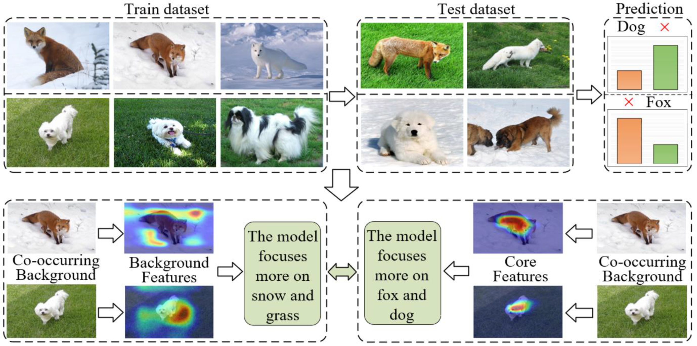
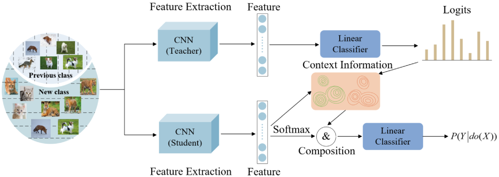
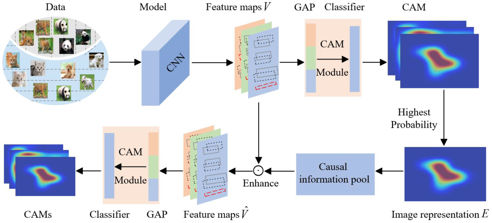

# Feature-Compatible Embeddings
This is the official PyTorch code for the paper:

**CIACB-CIL: Causal Inference for Addressing Contextual Biases in Class-Incremental Learning.**

**Jing Yang**, **Hongchao An**,  **Xiuhua Zhang**,  **Yuling Chen**,  **Wei Zhang**, **Chengjiang Li**, **Xiaoli Ruan**, **Zhidong Su**

**This is the overall methodology diagram of the paper:**

Fig. 1. The upper part represents a misclassification caused by confounding context (e.g., background information) in CIL. The foxes in the training set are
usually located on white snow, whereas dogs are on green grass; because of these context-induced biases, foxes appearing on green grass are misclassified as
dogs, and dogs appearing on white snow are misclassified as foxes during the test. The bottom half shows the results of a visualization comparison between
the scenarios with and without contextual bias; the left side is the result of the method with contextual bias, which focuses more on irrelevant background
features, while the right side is the result obtained by the method proposed in this work, which can effectively focus on the core features.
<p align="center">
  
</p>

Fig. 2. CID. Removing contextual biases from teacher models by implementing causal intervention in CIL and acquiring contextual information to better
guide the learning processes of the student models.
<p align="center">
  
</p>

Fig. 2. Causal intervention distillation. Removing Contextual Bias in Teacher Models by Causal Intervention in CIL and Acquiring Contextual Information
to Better Guide Learning in Student Models.
<p align="center">
  
</p>

## Prerequisites
The following packages are required to run the scripts:

- [torch](https://github.com/pytorch/pytorch)
- [torchvision](https://github.com/pytorch/vision)
- [tqdm](https://github.com/tqdm/tqdm)
- [numpy](https://github.com/numpy/numpy)

## Training scripts

Train CIFAR-100: ``` python main.py --config=./hyperparameter/b50inc10.json ```

Train ImageNet:  ``` python main.py --config=./hyperparameter/imagenet100.json ```


